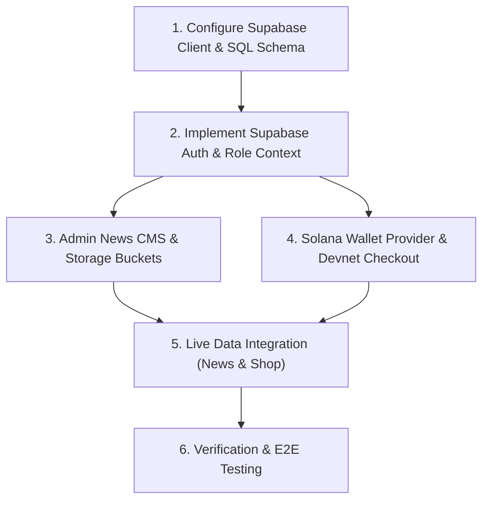

# Implementation Plan - Supabase Backend & Solana Web3 Integration for Intyfe Marketplace

This document provides a tailored implementation plan using **Supabase** as the Backend-as-a-Service (BaaS) for the Intyfe Marketplace (React 19 + Vite + TypeScript + React Router v7).
The project requires configuring a Supabase Backend-as-a-Service (BaaS) and integrating a Solana Web3 wallet. The frontend uses React 19, Vite, TypeScript, and React Router v7. Supabase was selected because it delivers a PostgreSQL database, authentication, file storage, and REST APIs without requiring a backend migration from the existing Vite React Single Page Application. It also natively handles Role-Based Access Control (RBAC) via PostgreSQL Row Level Security (RLS).

---

## Architectural Summary: React 19 + Vite + Supabase

```
+---------------------------------------------------------------------------------+
|                                 FRONTEND CLIENT                                 |
|                       React 19 + Vite + React Router v7                        |
|                                                                                 |
|  +--------------------+  +---------------------+  +--------------------------+  |
|  |   Buyer / Seller   |  |   Admin News CMS    |  |  Solana Wallet Adapter   |  |
|  |     Auth Views     |  |   (/admin/news)     |  |   (Phantom / Solflare)   |  |
|  +---------+----------+  +----------+----------+  +------------+-------------+  |
+------------|------------------------|--------------------------|----------------+
             |                        |                          |
             v                        v                          v
+---------------------------------------------------------------------------------+
|                                SUPABASE SERVICES                                |
|                                                                                 |
|  +--------------------+  +---------------------+  +--------------------------+  |
|  |   Supabase Auth    |  |  Supabase Storage   |  |   PostgreSQL + RLS       |  |
|  |  (Email, Password, |  |  (article-images &  |  |  (profiles, news,        |  |
|  |   Role Metadata)   |  |   product-images)   |  |   products, orders)      |  |
|  +--------------------+  +---------------------+  +--------------------------+  |
|                                                                                 |
|  +---------------------------------------------------------------------------+  |
|  |                       Supabase Edge Function                              |  |
|  |           verify-solana-tx (Verifies Solana RPC Tx Signatures)            |  |
|  +---------------------------------------------------------------------------+  |
+---------------------------------------------------------------------------------+
```

### Why Supabase fits this project:
1. **Instant Backend Infrastructure**: Provides PostgreSQL database, Authentication, File Storage, and auto-generated REST APIs out of the box.
2. **Built-in Role-Based Access Control (RBAC)**: PostgreSQL Row Level Security (RLS) policies enforce security directly in the database (Buyer vs. Seller vs. Admin).
3. **No Migration Necessary**: The existing Vite React SPA connects to Supabase seamlessly using `@supabase/supabase-js`.

---

## Supabase Database Schema & RLS Security

### 1. Database Schema SQL

```sql
-- 1. Create User Roles Enum
CREATE TYPE user_role AS ENUM ('buyer', 'seller', 'admin');

-- 2. Profiles Table (Extends Supabase auth.users)
CREATE TABLE public.profiles (
  id UUID PRIMARY KEY REFERENCES auth.users(id) ON DELETE CASCADE,
  email TEXT NOT NULL,
  full_name TEXT,
  avatar_url TEXT,
  role user_role DEFAULT 'buyer'::user_role NOT NULL,
  solana_wallet_address TEXT UNIQUE,
  created_at TIMESTAMPTZ DEFAULT NOW() NOT NULL
);

-- 3. News Articles Table (CMS)
CREATE TABLE public.news_articles (
  id UUID PRIMARY KEY DEFAULT gen_random_uuid(),
  slug TEXT UNIQUE NOT NULL,
  title TEXT NOT NULL,
  excerpt TEXT NOT NULL,
  content TEXT NOT NULL,
  image_url TEXT NOT NULL,
  category TEXT NOT NULL,
  author_id UUID REFERENCES public.profiles(id) ON DELETE SET NULL,
  published_at TIMESTAMPTZ DEFAULT NOW() NOT NULL,
  featured BOOLEAN DEFAULT FALSE,
  reading_time_minutes INT DEFAULT 5,
  created_at TIMESTAMPTZ DEFAULT NOW() NOT NULL
);

-- 4. Products Table (Shop Catalog)
CREATE TABLE public.products (
  id UUID PRIMARY KEY DEFAULT gen_random_uuid(),
  slug TEXT UNIQUE NOT NULL,
  title TEXT NOT NULL,
  description TEXT NOT NULL,
  price_sol NUMERIC(10, 4) NOT NULL,
  price_idr NUMERIC(15, 2) NOT NULL,
  category TEXT NOT NULL,
  image_url TEXT NOT NULL,
  gallery_images TEXT[] DEFAULT '{}',
  seller_id UUID REFERENCES public.profiles(id) ON DELETE SET NULL,
  in_stock BOOLEAN DEFAULT TRUE,
  tier TEXT DEFAULT 'Standard',
  created_at TIMESTAMPTZ DEFAULT NOW() NOT NULL
);

-- 5. Orders & Order Items
CREATE TABLE public.orders (
  id UUID PRIMARY KEY DEFAULT gen_random_uuid(),
  buyer_id UUID REFERENCES public.profiles(id) ON DELETE CASCADE,
  solana_tx_signature TEXT UNIQUE NOT NULL,
  total_price_sol NUMERIC(10, 4) NOT NULL,
  status TEXT DEFAULT 'pending' NOT NULL, -- 'pending', 'confirmed', 'failed'
  wallet_address TEXT NOT NULL,
  created_at TIMESTAMPTZ DEFAULT NOW() NOT NULL
);

CREATE TABLE public.order_items (
  id UUID PRIMARY KEY DEFAULT gen_random_uuid(),
  order_id UUID REFERENCES public.orders(id) ON DELETE CASCADE,
  product_id UUID REFERENCES public.products(id) ON DELETE RESTRICT,
  quantity INT DEFAULT 1 NOT NULL,
  price_sol NUMERIC(10, 4) NOT NULL
);

-- 6. Trigger to Auto-create Profile on Sign-up
CREATE OR REPLACE FUNCTION public.handle_new_user()
RETURNS TRIGGER AS $$
BEGIN
  INSERT INTO public.profiles (id, email, full_name, role)
  VALUES (
    NEW.id,
    NEW.email,
    COALESCE(NEW.raw_user_meta_data->>'full_name', ''),
    COALESCE((NEW.raw_user_meta_data->>'role')::user_role, 'buyer'::user_role)
  );
  RETURN NEW;
END;
$$ LANGUAGE plpgsql SECURITY DEFINER;

CREATE TRIGGER on_auth_user_created
  AFTER INSERT ON auth.users
  FOR EACH ROW EXECUTE FUNCTION public.handle_new_user();
```

### 2. Row Level Security (RLS) Policies

```sql
-- Enable RLS on all tables
ALTER TABLE public.profiles ENABLE ROW LEVEL SECURITY;
ALTER TABLE public.news_articles ENABLE ROW LEVEL SECURITY;
ALTER TABLE public.products ENABLE ROW LEVEL SECURITY;
ALTER TABLE public.orders ENABLE ROW LEVEL SECURITY;

-- Profiles Policies
CREATE POLICY "Public profiles are readable by everyone" ON public.profiles FOR SELECT USING (true);
CREATE POLICY "Users can update own profile" ON public.profiles FOR UPDATE USING (auth.uid() = id);

-- News Articles Policies
CREATE POLICY "News articles readable by everyone" ON public.news_articles FOR SELECT USING (true);
CREATE POLICY "Only Admin can insert news" ON public.news_articles FOR INSERT
  WITH CHECK (EXISTS (SELECT 1 FROM public.profiles WHERE id = auth.uid() AND role = 'admin'));
CREATE POLICY "Only Admin can update news" ON public.news_articles FOR UPDATE
  USING (EXISTS (SELECT 1 FROM public.profiles WHERE id = auth.uid() AND role = 'admin'));
CREATE POLICY "Only Admin can delete news" ON public.news_articles FOR DELETE
  USING (EXISTS (SELECT 1 FROM public.profiles WHERE id = auth.uid() AND role = 'admin'));

-- Products Policies
CREATE POLICY "Products readable by everyone" ON public.products FOR SELECT USING (true);
CREATE POLICY "Sellers and Admins can insert products" ON public.products FOR INSERT
  WITH CHECK (EXISTS (SELECT 1 FROM public.profiles WHERE id = auth.uid() AND role IN ('seller', 'admin')));

-- Orders Policies
CREATE POLICY "Buyers can view own orders" ON public.orders FOR SELECT
  USING (auth.uid() = buyer_id OR EXISTS (SELECT 1 FROM public.profiles WHERE id = auth.uid() AND role = 'admin'));
CREATE POLICY "Authenticated users can create orders" ON public.orders FOR INSERT
  WITH CHECK (auth.uid() = buyer_id);
```

---

## Detailed Task Breakdown

### Task 1: Supabase Integration & Client Configuration

#### 1.1 Environment & Package Installation
- Install `@supabase/supabase-js` package.
- Create `.env` file with Supabase URL & Anon Key:
  ```env
  VITE_SUPABASE_URL=https://your-project.supabase.co
  VITE_SUPABASE_ANON_KEY=your-anon-key
  VITE_SOLANA_TREASURY_WALLET=your-treasury-pubkey
  ```

#### 1.2 [NEW] `src/lib/supabase.ts`
- Initialize Supabase client:
  ```typescript
  import { createClient } from '@supabase/supabase-js';

  const supabaseUrl = import.meta.env.VITE_SUPABASE_URL || '';
  const supabaseAnonKey = import.meta.env.VITE_SUPABASE_ANON_KEY || '';

  export const supabase = createClient(supabaseUrl, supabaseAnonKey);
  ```

---

### Task 2: Multi-Role Authentication (Buyer, Seller, Admin)

#### 2.1 [NEW] `src/context/AuthContext.tsx`
- Manage auth state using `supabase.auth.onAuthStateChange`.
- Fetch active user profile from `public.profiles` to check `role` (`'buyer'`, `'seller'`, or `'admin'`).
- Provide functions: `signUp()`, `signIn()`, `signOut()`, and `linkSolanaWallet()`.

#### 2.2 [NEW] `src/pages/SignUp.tsx` & `src/pages/Login.tsx`
- Add Buyer vs Seller role toggle in sign-up form.
- Form validation and error messaging.

#### 2.3 [NEW] `src/components/ProtectedRoutes.tsx`
- `RequireAuth`: Restricts route to logged-in users.
- `RequireAdmin`: Restricts route to users with `role === 'admin'`.
- `RequireSeller`: Restricts route to users with `role === 'seller'` or `'admin'`.

---

### Task 3: Admin CMS for News Section

#### 3.1 [NEW] `src/pages/AdminNews.tsx`
- Dashboard for Admin users at route `/admin/news`.
- Displays table/cards of all articles with actions to edit, delete, or add new articles.

#### 3.2 [NEW] `src/pages/AdminNewsEditor.tsx`
- Article creation & edit form (Title, Slug, Excerpt, Content, Category, Reading Time, Featured status).
- Integrated image upload to Supabase Storage bucket `article-images`.

#### 3.3 [MODIFY] [News.tsx](file:///d:/IDP-opentech/intyfe-marketplace/src/pages/News.tsx) & [NewsDetail.tsx](file:///d:/IDP-opentech/intyfe-marketplace/src/pages/NewsDetail.tsx)
- Fetch real articles from Supabase `news_articles` table instead of hardcoded mock data.

---

### Task 4: Solana Wallet Integration & Web3 Checkout

#### 4.1 Solana Wallet Dependencies
- Install `@solana/web3.js`, `@solana/wallet-adapter-base`, `@solana/wallet-adapter-react`, `@solana/wallet-adapter-react-ui`, `@solana/wallet-adapter-wallets`.

#### 4.2 [NEW] `src/context/SolanaWalletProvider.tsx`
- Wrap app with Solana wallet context (Devnet endpoint).
- Configure Phantom & Solflare wallet adapters.

#### 4.3 [MODIFY] [Checkout.tsx](file:///d:/IDP-opentech/intyfe-marketplace/src/pages/Checkout.tsx)
- Connect real Solana wallet with `useWallet()`.
- Execute SOL transfer transaction using `SystemProgram.transfer`.
- Store confirmed transaction signature in Supabase `orders` table.

#### 4.4 [NEW] Supabase Edge Function `verify-solana-tx` (Optional Backend Guard)
- Validates transaction signature on Solana Devnet/Mainnet RPC to confirm transaction recipient and amount before updating order status to `'confirmed'`.

---

## Roadmap & Sequence



---

## Verification Plan

### Automated & Database Verification
- Run SQL schema and RLS policies in Supabase SQL Editor.
- Test RLS security: verify non-admin user receives permission denied when inserting into `news_articles`.

### Manual Testing Steps
1. **User Sign Up**: Create a Buyer account and a Seller account, verify `profiles` table is auto-populated with correct role.
2. **Admin CMS**: Sign in as Admin, create a new news article with image upload, verify public display on `/news`.
3. **Solana Wallet Checkout**: Connect Phantom Devnet wallet, execute a SOL checkout, verify signature recorded in Supabase `orders` table.
